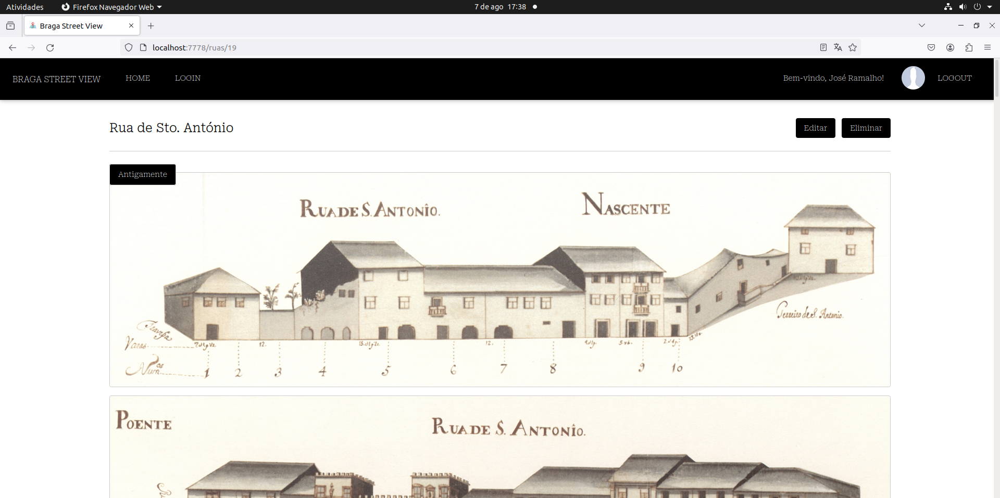
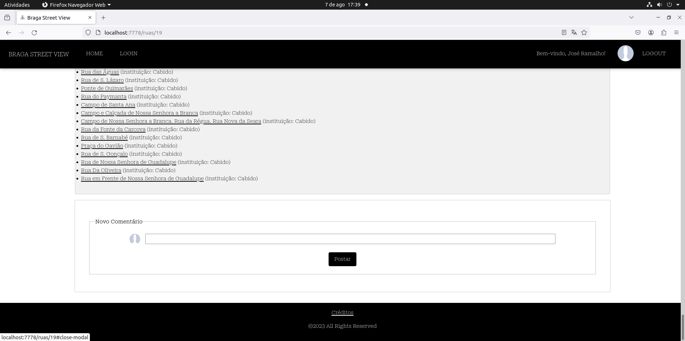

# Relatório

## Relatório do Projeto de Ruas de Braga

- Data de entrega: 2023-07-02
- UC: Engenharia Web - 2023
- O projeto foi desenvolvido pelos seguintes elementos:
  - [Henrique Ribeiro Fernandes, A95323 - 0HenriqueFernandes0](https://github.com/0HenriqueFernandes0)
  - [João Paulo Peixoto Castro, A97223 - joaocasr](https://github.com/joaocasr)
  - [Mateus Pereira, A91924](https://github.com)

## Introdução

Este relatório descreve o projeto desenvolvido no âmbito da disciplina de Engenharia Web - 2023, cujo objetivo foi a criação de um site sobre as estradas da cidade de Braga. 

O projeto foi implementado utilizando a framework Express e envolveu a construção de um sistema de gestão de dados, uma API de acesso a esses dados e uma interface interativa para os utilizadores. 

O site permite aos utilizadores visualizar informações sobre as ruas, ruas relacionadas, comentários e interagir com o sistema através de funcionalidades como adicionar comentários e ruas.

## Visão Geral da Aplicação








## Descrição dos Datasets

- **Dataset de Ruas:**
  - O dataset principal era constituído por 60 Ficheiros XML, sendo que cada um possuía informações de cada uma das ruas de Braga, nomeadamente, casas, imagens, descrição, proprietários, rendas, etc.
  - Como ponto de partida, foi desenvolvido um script em Python que itera por cada um dos ficheiros presentes na diretoria dos dados e os converte para um formato JSON usando o módulo `xmltodict`.
  - Foram realizados tratamentos adicionais, como a inserção de identificadores `_id`, alteração de algumas estruturas de dados de certos campos e adição de expressões regulares de substituição, de forma a permitir a interpolação de tags em Pug, entre outros procedimentos.

- **Dataset de Ruas Relacionadas:**
  - O dataset de ruas relacionadas foi construído com o auxílio do script Python `ruas_relacionadas.py`, que tem como entrada o `streetdb.json` (dataset das ruas).
  - Para cada uma das ruas, verificou-se se existia uma rua com a mesma palavra-chave de um dado tipo.
  - Cada uma das ruas terá um dicionário semelhante a:
    ```javascript
    var a = "{ _id: xxx, nome: xxx, lugares: [{id:..., nome:...., atributo:....}, ...], entidades=[{id:..., nome:...., atributo:....}, ...], data=[{id:..., nome:...., atributo:....}, ...] }"
    ```
  - Cada rua terá três listas de ruas relacionadas, uma por lugar, outra por entidade e outra por data.

- **Dataset de Comentários:**
  - O modelo do dataset é constituído por uma data, um parágrafo, um identificador da rua correspondente ao comentário, assim como informações relativas ao utilizador desse comentário.
  - O POST e o GET de comentários são feitos com o auxílio do JQuery. A informação do utilizador encontra-se no value de um input com type hidden (username e imagem de perfil). 

## Serviços implementados

**API**

A api de dados responde na porta 7777 e às seguintes rotas: 
- GET `/api/ruas`: Devolve uma lista de todas as ruas.
- GET `/api/ruas/:id`: Devolve os detalhes de uma rua específica.
- GET `/api/ruas/related/:idRua`: Devolve um registo de ruas relacionadas com a rua de identificador :idRua
- GET `/api/ruas/:id/comentarios`: Devolve uma lista de todos os comentários
- GET `/api/ruas/comentarios/:idRua`: Devolve uma lista de comentários respetivos à rua de identificador :idRua
- POST `/api/ruas/:id/comentarios`: Acrescenta um registo de um comentário à coleção de comentarios
- POST `/api/ruas`: Acrescenta um registo de um rua à coleção streets. No que toca à resposta a esta rota criou-se uma função auxiliar que vai percorrer as listas de para.lugar, para.data, e para.entidades da respetiva rua e verificar com queries definidas no controller a lista de ruas que possuem as palavras-chave em comum. Logo, este método teve que ser assíncrono de forma a esperar(await) que os dados da query realizada fossem obtidos em primeiro lugar. Estes dados foram sendo armazenados num dicionário do tipo : const related ={"_id":rua._id,nome:rua.nome,lugares: [], data: [], entidades: [] }. Por exemplo,no que toca a procurar as ruas que possuem o mesmo lugar, foi desenvolvida a seguinte query: Mapa.find({"\$or":[{"para": {"\$elemMatch": {"lugar": {"\$in": [lugar]}}}}, {"listacasas": {"\$elemMatch": {"desc.para.lugar": {"\$in": [lugar]}}}}]}), ou seja, procurou-se a presença de 'lugar' na 'lista de casas',nomeadamente na descrição das casas do para.lugar (lista) e no 'para' na descrição da rua na lista lugar. No entanto ao adicionarmos uma nova rua, também temos de ter em atenção que as restantes ruas já existentes têm que ter em conta a presença desta nova rua no seu índice de ruas relacionadas, pelo que fizemos push da rua em questão no sentido reverso, como se mostra no exemplo seguinte: Relations.updateOne({"_id":obj.id},{\$push:{lugares:{id:obj.nid,nome:obj.nome,atributo:obj.atributo}}}). Como este processo é feito de forma assíncrona, em que temos de esperar pela resposta das queries sobre a base de dados das coleções relations e streets, este processo pode ser um pouco lento, no entanto, como esse registo passa 
- DELETE `/api/ruas/:id`: Elimina um registo à coleção streets. Nesta rota foi necessário ter o cuidado de remover as ruas relacionadas à rua com identificador :id, assim como eliminar os seus comentários respetivos de modo a termos consistência na base de dados.

**Interface**

Este serviço responde na porta 7778 e irá responder aos seguintes endereços e rotas:

- http://localhost:7778/
  - Este endereço corresponde à página de autenticação de conta. Na rota GET / há uma verificação da existência da token que vem nos cookies com o auxílio da biblioteca jsonwebtoken. Caso exista e a autenticação seja efetuada com sucesso, é colocada a token na query do URL e é feita a renderização da página de listas das ruas e passamos a informação do usuário que se encontra no payload do request, de forma que quando seja apresentada a página, o utilizador tenha a garantia de que o processo foi bem-sucedido e que está conectado ao sistema com a sua conta. A interface, de modo a obter os dados das ruas, realiza um método GET com o auxílio da biblioteca axios. Para este efeito, foi realizado um `axios.get(env.apiAccessPoint+"/ruas"+"?token=" + req.cookies.token)`, em que `apiAccessPoint` é uma variável correspondente ao ponto de acesso para obter os dados em json igual a http://localhost:7777/api.

- http://localhost:7778/ruas/
  - Este endereço corresponde à página da listagem de ruas. Como a página das ruas se trata de uma zona protegida, é feita a verificação do token. Caso exista a token e não seja revogado, é feito o `next()`, sendo feita a próxima linha de execução, visto que estamos perante uma execução em pipeline. Caso contrário, o utilizador é redirecionado para a página de autenticação. Os dados são obtidos com o método GET do axios do seguinte modo `axios.get(env.apiAccessPoint+"/ruas"+"?token=" + req.cookies.token)`. O resultado do callback passamos para fazer a renderização da página com esses dados.

- http://localhost:7778/ruas/:idRua
  - Este endereço corresponde à página com informação da rua selecionada presente na lista de ruas. À semelhança da rota anterior, há verificação do token e, depois, é feito um pedido axios GET que devolve uma promessa que terá os dados da rua em questão: `axios.get(env.apiAccessPoint+"/ruas/"+req.params.idRua+"?token=" + req.cookies.token)`. Dentro do método `then` é feita outra promessa que irá devolver as ruas relacionadas com a rua em questão `axios.get(env.apiAccessPoint+"/ruas/related/"+req.params.idRua+ "?token=" + req.cookies.token)`. Por fim, é feita a renderização da página da rua com essa informação.

- GET /delete/:idRua
  - É feita a verificação do token e de seguida é feito pedido DELETE do axios com o id da rua a eliminar: `axios.delete(env.apiAccessPoint+"/ruas/"+req.params.idRua)`. Após este processo o utilizador é redirecionado para a página das ruas.

- GET /add
  - Este endereço corresponde à página para a adição de uma nova rua.

- POST /add
  - Nesta rota é feita uma verificação do token, depois com o auxílio da biblioteca multer especificámos os campos de adição de imagens da rua nova a adicionar. Existem dois campos/fields, um é o 'antigas' e o outro é atuais (correspondem aos nomes dos inputs file). Por sua vez, definimos um número máximo de 10 imagens em cada campo. No request `files` obtivemos o path destes ficheiros e, com a biblioteca filesystem, alteramos o path destes, de forma a ficarem hospedadas na diretoria public do serviço da interface. De seguida, procedeu-se à manipulação do body do request, para obtermos as imagens com este novo path. Por último, fizemos uma travessia por cada uma das descrições lugar, data, entidade novas da rua a inserir, colocando-as numa lista de dicionários no body.

- GET /ruas/edit/:idRua
  - Nesta rota, é realizado um pedido GET à API para obter as informações da rua desejada com base no parâmetro idRua. Essas informações serão disponibilizadas na página de edição para permitir a modificação dos campos desejados. Neste código, o router lida com um pedido GET para o endpoint `/ruas/edit/:idRua`. Dentro da função de tratamento da rota, é feito um pedido GET à API para obter as informações da rua utilizando o Axios. O `idRua` é extraído dos parâmetros da requisição e utilizado para construir a URL correta para o pedido à API. Após receber a resposta da API com os dados da rua, essas informações são armazenadas em uma variável chamada `street`. Em seguida, a página de edição é renderizada, passando o objeto `street` como contexto para a renderização. Dessa forma, a página de edição terá acesso às informações da rua e poderá preencher os campos correspondentes com os dados corretos. Caso ocorra algum erro durante o pedido à API, a rota renderizará a página de erro, exibindo o erro ocorrido. Isso garante que qualquer problema na obtenção das informações da rua seja tratado adequadamente.

- POST /
  - Esta rota corresponde a fazer um pedido POST na página de autenticação. Logo, com o access point do serviço de autenticação, foi efetuado um pedido POST na rota /login. Por sua vez, a promessa devolvida contém o token que é colocada nos cookies. Por último, o utilizador, caso tenha feito a autenticação com sucesso, é redirecionado para a rota /ruas. Caso contrário, é feito o render da página login com uma mensagem informativa de que os dados inseridos estão incorretos.

- GET /login
  - Nesta rota é feito o render da página de autenticação após verificação do token. Ou seja, caso o utilizador queira ir para a página de autenticação, ora até para posteriormente registrar uma nova conta, após estar conectado, esta rota será utilizada.

- GET /register
  - Nesta rota é feito o render da página de registro de conta após verificação do token.

- POST /register
  - Nesta rota, com o auxílio da biblioteca multer, fazemos o upload de uma única imagem que corresponde à imagem do utilizador da conta criada. Por fim, é feito um pedido POST ao serviço de AUTH com o axios da seguinte forma: `axios.post(env.authAccessPoint + "/register?token=" + req.cookies.token, formData)`. Esta promessa devolvida contém o token. Caso tenha feito o registo com sucesso, é redirecionado para a rota de ruas. Caso contrário, é feito o render da página register com uma mensagem informativa de que os dados inseridos estão incorretos.

- GET /logout
  - Esta rota corresponde a fazer o logout da conta em que se encontra conectado. Com o axios e a rota /logout do serviço AUTH, efetuamos um pedido GET. Após este processo, o utilizador é redirecionado para a página de autenticação.

- GET /ruas/images/:filename
  - Esta rota é utilizada para obter a imagem associada a uma rua. É feito um pedido GET à API para obter a imagem com base no nome do ficheiro (filename) fornecido. A API retornará a imagem correspondente como resposta. Nesta rota, o router lida com um pedido GET para o endpoint `/ruas/images/:filename`. O parâmetro `filename` é extraído da URL da requisição e utilizado para construir a URL correta para o pedido à API. A resposta da API é então encaminhada para o cliente, permitindo que a imagem seja exibida corretamente na interface.

**Autenticação**

Este serviço responde na porta 7779 e responde às seguintes rotas:

- POST /users/register
  - Nesta rota é criado um novo utilizador, sendo criado um objeto `userModel` com os campos que vêm no corpo da requisição (request body) ao submeter o formulário de registro de uma conta.

- POST /users/login
  - Nesta rota é feito o sign (assinatura) de um utilizador com o `jsonwebtoken`, cujo segredo é "EngWeb2023" e o tempo de expiração do token é de 3600 segundos, correspondente a 1 hora.

## Docker

O Docker é uma plataforma de contêineres que permite criar e executar aplicativos de forma detalhada e escalável. A configuração do Docker é definida no arquivo docker-compose.yml e consiste em três serviços: app, data_server e auth_server. Vamos dar uma breve descrição de cada um deles:

**App**

Este serviço é responsável por construir e executar o servidor da interface do projeto,o código-fonte está localizado na diretória "./Interface".
Ele reiniciava automaticamente em caso de falhas.
Estabelece as variáveis ​​de ambiente API_URL e AUTH_URL para que este consiga estabelecer conexao com os outros servers.
A porta 7778 do contêiner é mapeada para a porta 7778 do host, permitindo o acesso a aplicaçao por meio dessa porta.

**Data_server**

Este serviço garante e executa o servidor de dados do projeto, o código-fonte s está localizado na diretória "./API".
Ele reiniciava automaticamente em caso de falhas.
Estabeleça uma variável de ambiente MONGODB_URLpara estabelecer a conexão com a base de dados MongoDB.
A porta 7777 do contêiner é mapeada para a porta 7777 do host, permitindo o acesso ao servidor de dados por meio dessa porta.
Dependente do serviço mongodbpara para garantir que a base de dados esteja em execução antes do servidor de dados.

**Auth_server**

Este serviço garante e executa o servidor de autenticação do projeto,o código-fonte do servidor de autenticação está localizado no diretório "./AUTH".
Ele reiniciava automaticamente em caso de falhas.
Estabeleça uma variável de ambiente MONGODB_URL para estabelecer a conexão com a base de dados MongoDB.
A porta 7779 do contêiner é mapeada para a porta 7779 do host, permitindo o acesso ao servidor de autenticação por meio dessa porta.
Dependente do serviço mongodbpara garantir que a base de dados esteja em execução antes do servidor de autenticação.


Após testarmos nosso código-fonte com o Docker, notamos que ele não suporta uma funcionalidade da nossa aplicação: os comentários das ruas. Portanto, tomamos a decisão de desabilitar o código relacionado ao Docker e executar nossa aplicação sem o uso de contêineres.

Ao desabilitar o código do Docker, nosso aplicativo funcionará corretamente e todas as suas funcionalidades, incluindo os comentários das ruas, estarão disponíveis. Essa abordagem nos permite garantir o pleno funcionamento da aplicação.


## Conclusão

Em suma, o projeto de ruas de Braga consistiu no desenvolvimento de um website interativo, onde os utilizadores podem visualizar informações sobre as ruas da cidade e interagir com o sistema através de funcionalidades como adicionar comentários e ver ruas relacionadas. 

O projeto envolveu a criação de um sistema de gestão de dados, uma API de acesso a esses dados e uma interface interativa para os utilizadores. Através deste projeto, os elementos da equipa puderam aplicar e aprofundar os conhecimentos adquiridos na disciplina de Engenharia Web - 2023.
